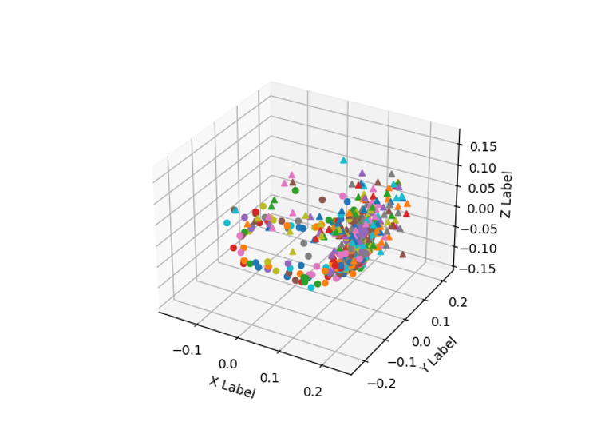

# *x*R-EgoPose

This repository contains the unoffical pyTorch implementation of xR-EgoPose in the paper ["*x*R-EgoPose: Egocentric 3D Human Pose from an HMD Camera"](http://openaccess.thecvf.com/content_ICCV_2019/papers/Tome_xR-EgoPose_Egocentric_3D_Human_Pose_From_an_HMD_Camera_ICCV_2019_paper.pdf) (ICCV 2019, oral).  
(**Failed to implement similar performance reported on the paper.**)

I tried to implement (the paper don't mention explicitly.)
* Neural Network Architecture
* * Training Details
* Data Augmentation Strategy

## License and Citation

```
@inproceedings{tome2019xr,
  title={xR-EgoPose: Egocentric 3D Human Pose from an HMD Camera},
  author={Tome, Denis and Peluse, Patrick and Agapito, Lourdes and Badino, Hernan},
  booktitle={Proceedings of the IEEE International Conference on Computer Vision},
  pages={7728--7738},
  year={2019}
}
```

The license agreement for the data usage implies citation of the paper. Please notice that citing the dataset URL instead of the publication would not be compliant with this license agreement.

# Data Preparation

Follow the instruction of [Official xR-EgoPose Dataset Repository](https://github.com/facebookresearch/xR-EgoPose) for downloading dataset.  
After downloading, open **data/config.yml**, and write your own dataset path.

Here are some visualizations of joint distributions in 3D space (Just watch triangle points.).
  
You can check LeftArm.png, LeftElbow.png, LeftHand.png, RightFoot.png, RightKnee.png, RightLeg.png for more joint visualizations.

# Results of implemented Model in terms of Full-body Average Evaluation Error (mm).

Tricks I tried.
* Pre-training & Fine-tuning
* Add BN in Lifting Module ([Reference](https://arxiv.org/abs/1705.03098))
* Add Dropout
* Change Root Joint from Neck to Hip ([Reference1](https://arxiv.org/abs/2008.09047), [Reference2](https://arxiv.org/abs/2008.03713))
* Improve Lifting Module Architecture
* Data Augmentation


</ul>
<table>
<thead>
<tr>
<th align="center">Dataset</th>
<th align="center">Naive Architecture & Training</th>
<th align="center">Pre-training & Fine-tuning</th>
<th align="center">BN in Lifting Module</th>
<th align="center">Dropout</th>
<th align="center">Change Root Joint</th>
<th align="center">Improve Lifting Module</th>
<th align="center">Data Augmentation</th>
<th align="center">ICCV19</th>
</tr>
</thead>
<tbody>
<tr>
<td align="center">xR-EgoPose</td>
<td align="center">280</td>
<td align="center">230</td>
<td align="center">110</td>
<td align="center">110</td>
<td align="center">110</td>
<td align="center">100</td>
<td align="center">100</td>
<td align="center">58</td>
</tr>
</tbody></table>

# Training

Open **data/config.yml**, and write your own settings.

Run
```
python train.py
```
